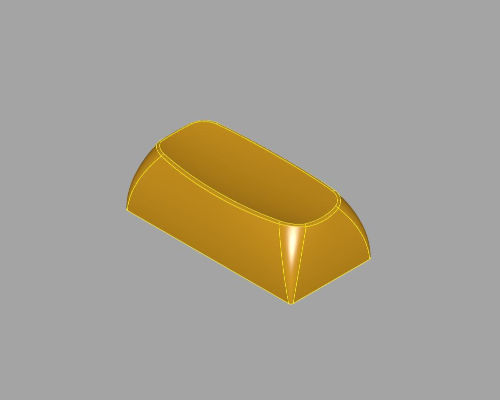
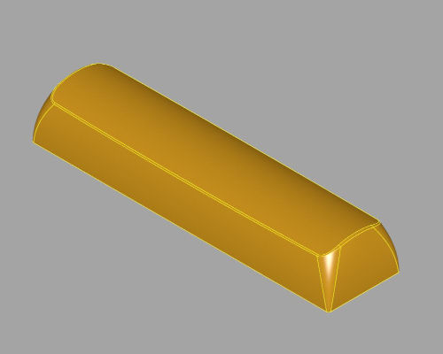

# OPK

OPK is a spherical top keycap profile developed in [CadQuery](https://github.com/CadQuery/cadquery) and released under the very permissive Apache License 2.0.

It's especially suited for creating high/medium profile spherical top keycaps.

**The profile is still highly experimental and very alpha stage.**

## Please help!

I'm new to CadQuery (CQ), Ptyhon and code based CAD in general. There's a lot of guesswork and fumbling around to get to this point, any help is very much appreciated. 

## Usage

If you are new to CQ, the easiest is to download a [CQ-Editor](https://github.com/CadQuery/CQ-editor) pre-built package, load the `keycap.py` file and hit **Render**!

CQ and CQ-Editor are eveolving fast. **It is important that you install the latest version of CQ and/or CQ-Editor.** The latest CQ-Editor dev release can be grabbed from [jmwright's repository](https://github.com/jmwright/CQ-editor/actions?query=workflow%3Abuild), get the latest successful build (you need to be logged in to download).

The latest Cadquery can be installed with PIP:

```
pip install --pre cadquery
```

The main ``keycap`` function in the ``opk.py`` file has sane defaults and parameters are sufficiently commented.

The *export* directory includes a few examples in both STL and STEP format.

Some examples:

**Create the default 1u keycap**
```
cap = keycap()
```


**Create a 1.5U keycap**
```
cap = keycap(unitX=1.5)
```


**Create a flat top (not angled) 2U keycap**
```
cap = keycap(unitX=2, angle=0)
```



**Create a 4U spacebar**
```
cap = keycap(unitX=4, angle=1, convex=True)
```



**A 2.25U Return key in system-default-serif font**
```
cap = keycap(unitX=2.25, legend="Return", font="serif", fontsize=8)
```


## Save and Export results

CQ can export in many formats including STEP and STL. The easiest way to export an STL in CQ-Editor is by selecting the model in the 3D view and then clicking on *Tools > Export as STL*.

Of course it can be done programmatically and that can make exporting an entire keyboard very easy. The following code exports an STL and a STEP file.

```
cap = keycap()

exporters.export(cap, 'keycap.stl', tolerance=0.001, angularTolerance=0.05)
exporters.export(cap, 'keycap.step')
```

## Notes / Recommendations

Default angle is 7deg that should be a good starting point for Row 3.

For spacebars a small angle (0-4deg) is recommended.

Not all fonts will be centered correctly, choose carefully. I'll add some way to better center the legends.

The code includes an example to use a DXF drawing as legend (check the comments at the end of the keycap function). This will be exposed to the API soon.

## TODO
- add stepped key
- add ISO Enter
- ~~add 2U pos-like stabilizers~~
- ~~add support for logos and graphical legends~~
- add reinforcement for big keys
- add more examples
- output files already supported for 3D printing
- online editor
- add secondary/tertiary legends
- add support for stems other than cherry
- clean up the code and do things "the python way"
- better documentation
